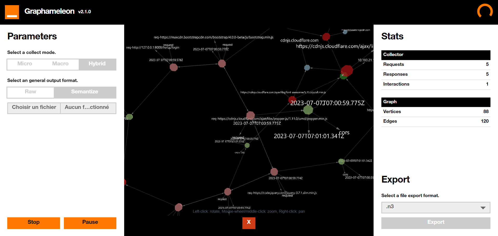
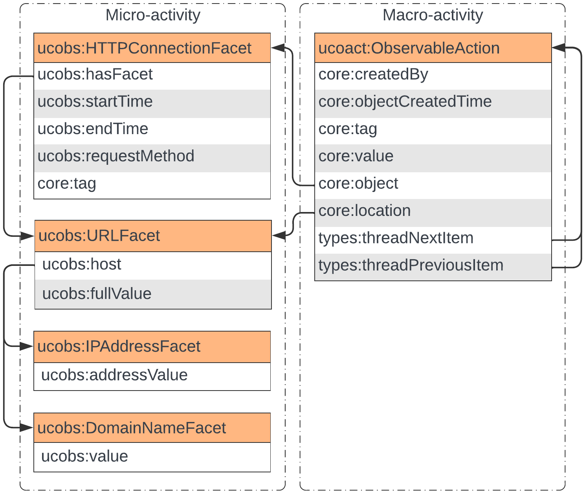

<h1>
    Graphameleon Web extension 
    <sub></sub>
    <sub></sub>
    <sub></sub>
</h1>

**Graphameleon** is a Web Browser Extension which collects and semantizes Web navigation traces.



Following research on the [NORIA-O](https://github.com/Orange-OpenSource/noria-ontology) and [DynaGraph](https://github.com/Orange-OpenSource/dynagraph) projects, the Graphameleon Web extension brings visualization and recording of Web navigation traces at the browser level.
Then, leveraging knowledge graph representations, to perform User and Entity Behavior Analytics (UEBA) and Anomaly Detection (AD).

The extension incorporates an internal semantical mapping module that relies on the [RMLmapper](https://rml.io/) library to construct a RDF knowledge graph during navigation.
Additionally, it utilizes the [React-Force-Graph](https://github.com/vasturiano/react-force-graph) visualization library, allowing users to view their navigation traces in a 3D representation of the knowledge graph.

If you use this software in a scientific publication, please cite:

> Benjamin Stach, Lionel Tailhardat, Yoan Chabot, and Raphaël Troncy. 2023.
> Graphameleon: Relational Learning and Anomaly Detection on Web Navigation Traces Captured as Knowledge Graphs.

BibTex format:

```bibtex
@inproceedings{graphemeleon-2023,
  title = {{Graphameleon: Relational Learning and Anomaly Detection on Web Navigation Traces Captured as Knowledge Graphs}},
  author = {{Benjamin Stach} and {Lionel Tailhardat} and {Yoan Chabot} and {Rapha\"el Troncy}},
  year = {2023}
}
```

## Usage

### Build

Pre-requisites:

* Downloading and installing [Node.js](https://nodejs.org/) and [npm](https://docs.npmjs.com/downloading-and-installing-node-js-and-npm)
* Cloning the repository to your computer
* Installing third-party npm modules: `npm install`

Create a build for **Firefox**:

```shell
# Firefox is considered to be the browser by default for the build process
npm run start
```

Create a build for **Chrome**:

```shell
npm run start:chrome
```

Create a build for **Edge**:

```shell
npm run start:edge
```

Clean the distribution file:

```shell
npm run clean
```

---

<h3 style="display:flex; align-items:end; gap:12px">
    
    Run on Firefox
</h3>

1. First, open a firefox navigation window and go to the following page: `about:debugging#/runtime/this-firefox`
2. In the **Temporary Extensions** section, click on the **Load Temporary Add-on...** button.
3. Then, select the `manifest.json` from the `./dist` or any other file from the same directory to load the extension.

The **Graphameleon** Extension is now loaded on Firefox !

---

<h3 style="display:flex; align-items:end; gap:12px">
    
    Run on Chrome
</h3>

1. First, open a chrome navigation window and go to the following page: `chrome://extensions/`
2. Enable the **Developer Mode** on the top-right corner.
2. Click on the **Load unpacked** button.
3. Then, select the `manifest.json` from the `./dist` or any other file from the same directory to load the extension.

The **Graphameleon** Extension is now loaded on Chrome !

---

<h3 style="display:flex; align-items:end; gap:12px">
    
    Run on Edge
</h3>

1. First, open an edge navigation window and go to the following page: `edge://extensions/](edge://extensions/`
2. Enable the **Developer Mode** on the left navigation bar.
3. Click on the **Load unpacked** button.
4. Then, select the `manifest.json` from the `./dist` or any other file from the same directory to load the extension.

The **Graphameleon** Extension is now loaded on Edge !

---

### Data capture

The general process for performing data capture is as follows:

1. Open the Graphameleon component, this brings a Graphameleon panel
2. Select a capture mode (see table below for details):
    - micro
    - macro
    - hybrid
3. Select a general output format:
    - raw
    - semantize: the data will be mapped according to a RDF data model (ontology); 
   you must then select a mapping definition file in [RML](https://rml.io/) syntax (`.ttl` extension) using the *Browse* button.
   See mapping definition examples in the [mapping/](mapping) folder.
4. Start data capture with the *Record* button
5. Navigate the Web in the other Web browser tabs
6. Stop data capture with the *Stop* button from the Graphameleon panel
7. Select a file export format:
    - Raw capture: [JSON](https://tools.ietf.org/html/rfc8259) | [CSV](https://tools.ietf.org/html/rfc4180)
    - Semantize capture: [N-Triples](https://www.w3.org/TR/n-triples/) | [Turtle](https://www.w3.org/TR/turtle/)
8. Export the data with the *Export* button, the resulting data will be saved in the Web browser's default download folder.

#### Data collected with Graphameleon

The following table shows the type of data collected by the Graphameleon Web extension as a function of the **capture mode** (micro-activity *vs* macro-activity), and grouped by their **scope** (request *vs* interaction *vs* both):

| Scope         | Feature/header name | Micro | Macro |
|---------------|---------------------|-------|-------|
| *Request*     | Method              | Yes   | Yes   |
|               | URL                 | Yes   | Yes   |
|               | IP                  | Yes   | Yes   |
|               | Domain              | Yes   | Yes   |
|               | Sec-Fetch-Dest      | Yes   | Yes   |
|               | Sec-Fetch-Site      | Yes   | Yes   |
|               | Sec-Fetch-User      | Yes   | Yes   |
|               | Sec-Fetch-Mode      | Yes   | Yes   |
| *Interaction* | EventType           | -     | Yes   |
|               | Element             | -     | Yes   |
|               | Base URL            | -     | Yes   |
| *Both*        | User-Agent          | Yes   | Yes   |
|               | Start time          | Yes   | Yes   |
|               | End time            | Yes   | Yes   |

#### Data model for user activities

The following class diagram defines the concepts and properties used for the semantic representation of **micro-activities** (left) and **macro-activities** (right):



For **micro-activities**, the presented classes and properties accurately describe a sequence of requests captured at the Web browser level.
**Macro-activities** further enhance the modeling by allowing the description of interactions.

The names of concepts and properties used here are defined within the UCO vocabulary, the following namespaces apply:
* `core` : https://ontology.unifiedcyberontology.org/uco/core#
* `ucobs` : https://ontology.unifiedcyberontology.org/uco/observable#
* `types` : https://ontology.unifiedcyberontology.org/uco/types#

#### Example dataset

Please check the [*graphameleon-ds*](https://github.com/Orange-OpenSource/graphameleon-ds) repository for examples of data captured using the Graphameleon Web extension.

---

### Repository structure

```tree
📁 graphameleon
├───📁 mapping/ <Default semantical mapping rules (RML, YARRRML)>
│   └───...
├───📁 public/
│   ├───📁 assets/ <All assets files>
│   │   └───...
│   ├───📄 index.html
│   ├───📄 manifest.chrome.json <Manifest V3 for Chrome based browsers>
│   └───📄 manifest.firefox.json <Manifest V2 for Firefox browser>
├───📁 src/ <Extension source code>
│   ├───📁 app/ <Application-specific files>
│   │   ├───📁 components/ <React UI components and panels>
│   │   │   └───...
│   │   └───📄 App.jsx <React app>
│   ├───📁 scripts/ <Extension scripts (background, content) and modules>
│   │   ├───📁 modules/
│   │   │   ├───📄 Interaction.js <Interaction collector>
│   │   │   ├───📄 Manager.js <Managing communications, collections and mapping>
│   │   │   ├───📄 Mapper.js <Mapping management, graph builder>
│   │   │   └───📄 Request.js <Request collector>
│   │   ├───📁 utils/
│   │   │   ├───📄 mapping.js <Raw string default semantical mapping rules (RML)>
│   │   │   ├───📄 settings.js <Cross-browser specifiations>
│   │   │   └───📄 tools.js <Handcrafted usefull functions>
│   │   ├───📄 background.js <Background script: manager, mapper and request collector>
│   │   └───📄 content.js <Content script: interaction collectors>
│   └───📄 index.jsx
└───...
```

## License

[BSD-4-Clause](LICENSE.txt)

## Copyright

Copyright (c) 2022-2023, [Orange](https://hellofuture.orange.com/). All rights reserved.

## Maintainer

* [Benjamin STACH](mailto:benjaminstach.pro@gmail.com)
* [Lionel TAILHARDAT](mailto:lionel.tailhardat@orange.com)
* [Yoan CHABOT](mailto:yoan.chabot@orange.com)
* [Raphaël TRONCY](mailto:raphael.troncy@eurecom.fr)
