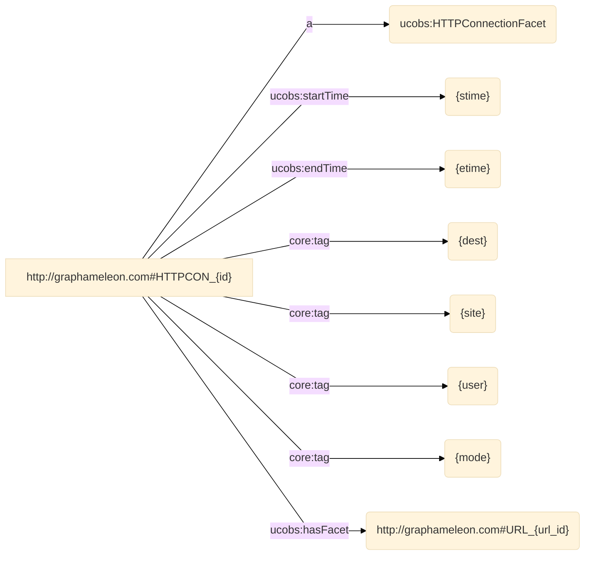
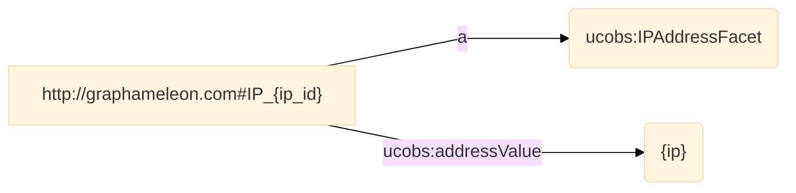
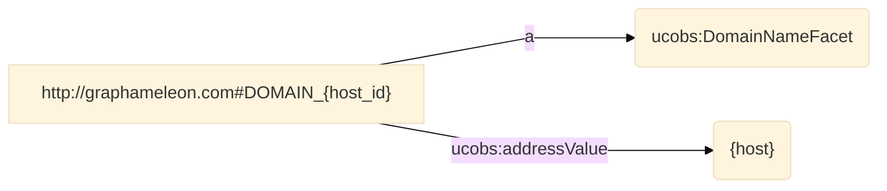
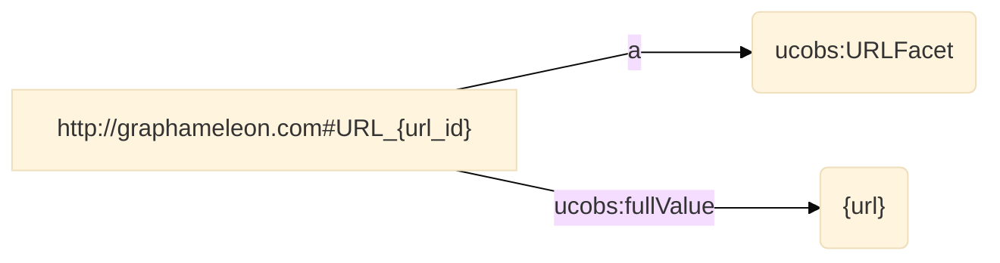
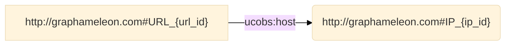
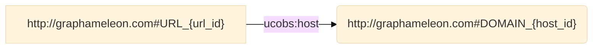

   
# Graphameleon - micro
   
   
**Version:**

* 2.1.0
   
**Authors**:

    
* Benjamin STACH
   
    
* Lionel TAILHARDAT
   

**Mapping file:**
rules.ttl

**Description**: RML mapping for data collection using Graphameleon in micro mode.


**Date created**: 14-03-2024

**License**:
* https://github.com/Orange-OpenSource/graphameleon/blob/main/LICENSE.txt (v2.1.0)


------


## **Namespaces used in the document**

| Prefix       |               IRI.                   |
| :----------- | :----------------------------------  |
| ql     | http://semweb.mmlab.be/ns/ql# |
| core     | https://ontology.unifiedcyberontology.org/uco/core# |
| dct     | http://purl.org/dc/terms/ |
| types     | https://ontology.unifiedcyberontology.org/uco/types# |
| rr     | http://www.w3.org/ns/r2rml# |
| ucoact     | https://ontology.unifiedcyberontology.org/uco/action# |
| schema1     | http://schema.org/ |
| v     | http://rdf.data-vocabulary.org/# |
| gpl     | http://graphameleon.com# |
| sd     | http://www.w3.org/ns/sparql-service-description# |
| map     | http://mapping.example.com/ |
| rml     | http://semweb.mmlab.be/ns/rml# |
| void1     | http://rdfs.org/ns/void#exampleResource |
| ucobs     | https://ontology.unifiedcyberontology.org/uco/observable# |


## Mappings
>[!NOTE]
>1. **Source**: This is where you define the source of your data, which can be a relational database, a CSV file, or any other structured data source. The logical source specifies the location and format of your source data.
>2. **Subject**: This part of the mapping defines how the data from the logical source will be used to create RDF subjects, typically using templates and column mappings.
>3. **Predicate Object**: These describe how the data from the logical source will be used to generate RDF triples, indicating relationships between subjects and objects.
>4. **JoinCondition**: is used to specify the conditions under which two data sources or tables should be joined when creating RDF triples through mappings.


## map_http_000
- **Source**

```bash
data.json
``` 
- **Subject**
```bash
http://graphameleon.com#HTTPCON_{id}
``` 
- **Predicate Object**

| Predicate | Object |
|:----------|:-------|
| a | ucobs:HTTPConnectionFacet |
| ucobs:startTime | {stime} |
| ucobs:endTime | {etime} |
| core:tag | {dest} |
| core:tag | {site} |
| core:tag | {user} |
| core:tag | {mode} |
| ucobs:hasFacet | http://graphameleon.com#URL_{url_id} |
- **RDF triples**

## map_ip_000
- **Source**

```bash
data.json
``` 
- **Subject**
```bash
http://graphameleon.com#IP_{ip_id}
``` 
- **Predicate Object**

| Predicate | Object |
|:----------|:-------|
| a | ucobs:IPAddressFacet |
| ucobs:addressValue | {ip} |
- **RDF triples**

## map_domain_000
- **Source**

```bash
data.json
``` 
- **Subject**
```bash
http://graphameleon.com#DOMAIN_{host_id}
``` 
- **Predicate Object**

| Predicate | Object |
|:----------|:-------|
| a | ucobs:DomainNameFacet |
| ucobs:addressValue | {host} |
- **RDF triples**

## map_url_000
- **Source**

```bash
data.json
``` 
- **Subject**
```bash
http://graphameleon.com#URL_{url_id}
``` 
- **Predicate Object**

| Predicate | Object |
|:----------|:-------|
| a | ucobs:URLFacet |
| ucobs:fullValue | {url} |
- **RDF triples**



- **Join Condition**:
    - Source triples map: **map_url_000**
    - Target triples map: **map_ip_000**
    - Function: **equal(ip, ip)**




- **Join Condition**:
    - Source triples map: **map_url_000**
    - Target triples map: **map_domain_000**
    - Function: **equal(host, host)**



 


----

**This documentation was generated using**  *[RMLdoc](https://oeg-upm.github.io/rmldoc/)*.
